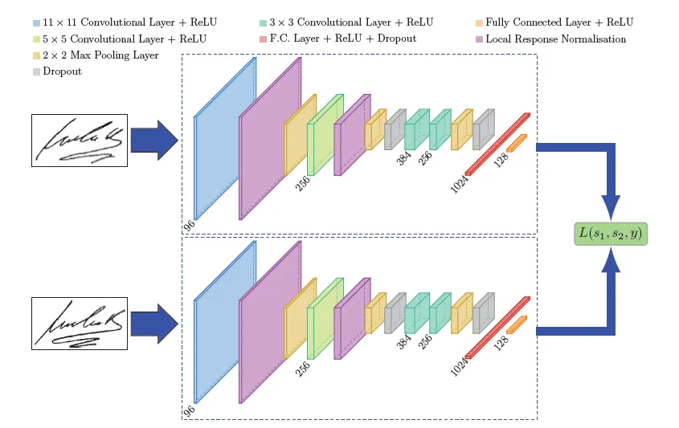
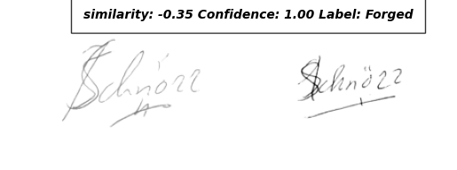
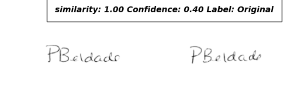

# Hand Signature Similarity using SNN (Siamese Neural Networks)

.jpeg)

## Table of Contents

- [Overview](#overview)
- [Dataset](#dataset)
- [Model Architecture](#model-architecture)
- [Loss Function](#loss-function)
- [Installation](#installation)
- [Usage](#usage)
- [Example](#example)
- [Acknowledgments](#acknowledgments)

## Overview

This project uses a Siamese Neural Network to compare and verify the similarity between signatures. The model is based on the SigNet architecture proposed in the paper [SigNet: Convolutional Siamese Network for Writer Independent Offline Signature Verification](https://arxiv.org/abs/1705.05787).
And it's trained on signature data to determine the similarity between two given signatures.

## Dataset

The model is trained on the [Signature Verification Dataset](https://www.kaggle.com/datasets/robinreni/signature-verification-dataset) available on Kaggle. This dataset contains a diverse collection of genuine and forged signatures, making it suitable for training a robust signature verification model.

## Model Architecture

The Siamese Neural Network consists of two identical subnetworks (SigNet) that share weights. These subnetworks process two input signatures and produce feature vectors. The similarity between these feature vectors is then used to determine if the signatures match.


<p align="center"><em>SigNet Architecture</em></p>


## Loss Function

We use Contrastive Loss to train our Siamese Neural Network. The loss function is defined as follows:

```
L(W,Y,X1,X2) = (1-Y) * 1/2(D_w)^2 + (Y) * 1/2(max(0, m-D_w))^2
```

Where:
- `W` are the model parameters
- `Y` is the label (0 for genuine pair, 1 for forged pair)
- `X1` and `X2` are the input signature pairs
- `D_w` is the cosine similarity between the output features
- `m` is the margin

## Installation

To set up this project, follow these steps:

1. Clone the repository:
   ```
   git clone https://github.com/ASBK-exe/Hand-Signature-Similarity.git
   cd Hand-Signature-Similarity
   ```

2. Create a virtual environment (optional but recommended):
   ```
   python -m venv venv
   source venv/bin/activate  # On Windows, use `venv\Scripts\activate`
   ```

3. Install the required packages:
   ```
   pip install -r requirements.txt
   ```

## Usage

To run the signature similarity check:

1. Ensure you have two signature images you want to compare.
2. Update the paths in `main.py` to point to your signature images:

   ```python
   img1 = preprocess.load_signature("path/to/first/signature.png")
   img2 = preprocess.load_signature("path/to/second/signature.png")
   ```

3. Run the script:
   ```
   python main.py
   ```

The script will output the similarity score and confidence level for the two signatures.

## Example

Here's an example of how the model compares two signatures:

 




In this example, the model compares an original signature with a forged one, outputting a similarity score and confidence level.

## Acknowledgments

- Initial weights were obtained from [luizgh/sigver](https://github.com/luizgh/sigver)
- Helper functions were adapted from [luizgh/sigver](https://github.com/luizgh/sigver)
- The SigNet model architecture is based on the paper [SigNet: Convolutional Siamese Network for Writer Independent Offline Signature Verification](https://arxiv.org/abs/1705.05787)

---

Feel free to contribute to this project by opening issues or submitting pull requests!